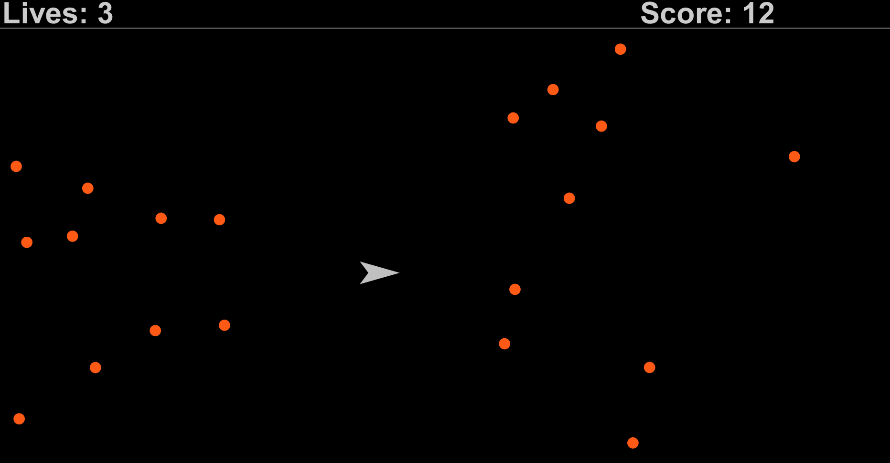

# Spaceship Game

 

In this simple Spaceship Game, you control a spaceship that is adrift in space. Your goal is to travel as far as possible without being hit by rocks. Are you up for this challenge?

### Details
This game was built in Java, using the [Kilt Graphics](https://mac-comp127.github.io/kilt-graphics/) library. It was completed in December 2019, as the final project for the Object-Oriented Programming and Abstraction class, at Macalester College, and updated in April, 2023.

### Controls
To control the spaceship and avoid the rocks, simply move your mouse around. Game over happens if you get hit by three rocks.

### Installation
To play the game, first download [Visual Studio Code](https://code.visualstudio.com/) and appropriate [Java Extensions](https://marketplace.visualstudio.com/items?itemName=vscjava.vscode-java-pack). Then, run the main method located in the ```Game.java``` class and have fun!

### Authors
Jonas Costa and Harry Werrell


